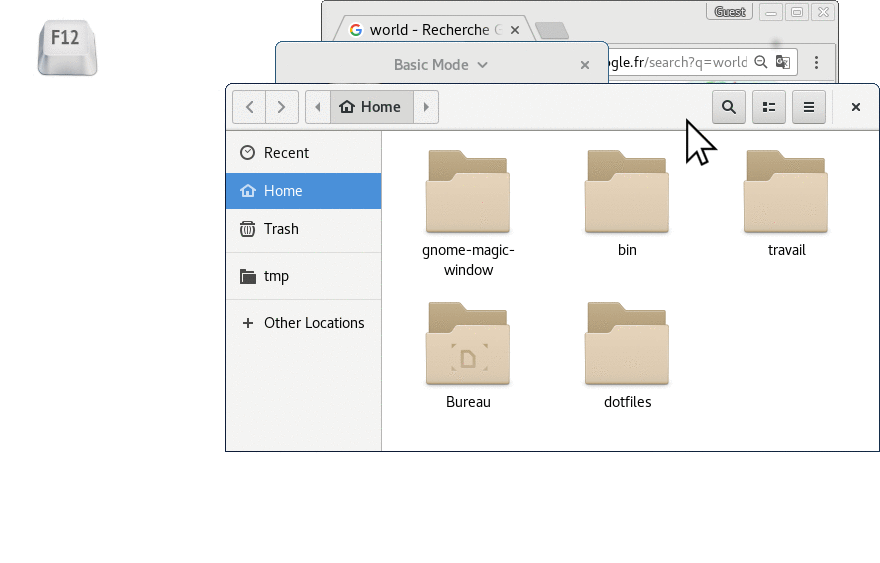

gnome-magic-window
==================

Bind keys to a specific program in Gnome Shell:
* When the corresponding key is pressed and this program is in background,
  its window is brought to the front.
* When the corresponding key is pressed and this program is already at the
  front, the last window is brought to the front again.
* When the corresponding key is pressed and the program isn't launched yet,
  it is spawned by running the program in the `command` property.

It is comparable to *Guake* and *Compiz Put*, except that gnome-magic-window
works with Gnome Shell and the new Wayland display server. (It does not use
xdotool and wmctrl, that worked with X11 but not with Wayland.)

## Demo



## Quick install

The following commands assume that one of the elements in `BINDINGS` has a
shortcut property of `F12`, a title of `Terminator` and a command of
`/usr/bin/terminator`.
* Replace `F12` with `Pause`, `<Super>a` or whichever key you prefer.
* Replace `Terminator` by the program to be brought to front when the key is
  pressed.
* Replace `/usr/bin/terminator` by the command to run if no window named
  `Terminator` is found. Make sure you use a absolute path.
* Remove any array elements from `BINDINGS` that you don't require.
* Uncomment the example or add a new array element to `BINDINGS` containing
  the shortcut, window title and the command to launch (which will be
  searched for on the `PATH` if not absolute.)

### 1. Install the extension

Since Gnome 41, gnome-magic-window is shipped as a Gnome extension. To install
this extension from the Git repository:

```shell
cd ~/.local/share/gnome-shell/extensions
git clone https://github.com/adrienverge/gnome-magic-window gnome-magic-window@adrienverge
```

### 2. Customize

Edit `extension.js` to set your favorite key, window name and command to
run, for example:

```javascript
const BINDINGS = [
  {
    shortcut: 'F12',
    title: 'Terminator',
    command: 'terminator'
  },
  {
    shortcut: 'F11',
    title: 'Show gworldclock',
    command: 'gworldclock'
  },
];
```

### 3. Enable the extension

After installing files and customizing, you probably need to close your session
and log in again in order for Gnome to the extension.

Either run:
```shell
gnome-extensions enable gnome-magic-window@adrienverge
```

Or open Gnome "Extensions" utility to enable the extension.

You're set! Try pressing your magic key.

### 4. Debug

In case it doesn't work, you may need to add your gnome version in
`metadata.json` and reload your session, or debug futher.

```shell
# Alt+F2↵ r↵
gdbus call --session --dest org.gnome.Shell --object-path /org/gnome/Shell/Extensions/GnomeMagicWindow --method org.gnome.Shell.Extensions.GnomeMagicWindow.magic_key_pressed Terminator terminator
```

## For Gnome versions < 41

Use this repo on commit 26230da or before, and read the README file from that
version.
